# Arsitektur Sistem INVESTRA
## Investment Analytics Indonesia Dashboard

---

## 1. Overview Arsitektur


---

## 2. Arsitektur 3-Layer

| Layer | Deskripsi | Teknologi |
|-------|-----------|-----------|
| **Presentation** | Halaman dan routing | Next.js 14 App Router |
| **Component** | UI dan logic komponen | React, Radix UI, Recharts |
| **Data** | Static data dan state management | React useState, Constants |

---

## 3. Technology Stack


---

## 4. Component Hierarchy

```mermaid
flowchart TD
    subgraph App["Next.js App Router"]
        RootLayout[RootLayout<br/>app/layout.tsx]
        
        subgraph PublicPages["Public Pages"]
            HomePage[page.tsx → LandingPage]
            LoginPage[login/page.tsx → LoginView]
        end
        
        subgraph DashboardPages["Dashboard Pages"]
            DashLayout[dashboard/layout.tsx]
            DashPage[dashboard/page.tsx]
            UploadPage[dashboard/upload/page.tsx]
            PCAPage[dashboard/pca/page.tsx]
            ClusterPage[dashboard/clustering/page.tsx]
            VisPage[dashboard/visualization/page.tsx]
            PolicyPage[dashboard/policy/page.tsx]
            AboutPage[dashboard/about/page.tsx]
        end
    end
    
    RootLayout --> HomePage
    RootLayout --> LoginPage
    RootLayout --> DashLayout
    DashLayout --> DashPage
    DashLayout --> UploadPage
    DashLayout --> PCAPage
    DashLayout --> ClusterPage
    DashLayout --> VisPage
    DashLayout --> PolicyPage
    DashLayout --> AboutPage
```



---

## 5. Data Flow Diagram


---

## 6. File Structure

```
investment_inequality_dashboard/
├── app/                          # Next.js App Router
│   ├── layout.tsx               # Root layout
│   ├── page.tsx                 # Landing page (/)
│   ├── globals.css              # Global styles
│   ├── login/page.tsx           # Login page
│   └── dashboard/
│       ├── layout.tsx           # Dashboard layout
│       ├── page.tsx             # Dashboard main
│       ├── upload/page.tsx
│       ├── pca/page.tsx
│       ├── clustering/page.tsx
│       ├── visualization/page.tsx
│       ├── policy/page.tsx
│       └── about/page.tsx
├── components/                   # Reusable components
│   ├── ui/                      # UI primitives (10 files)
│   └── *.tsx                    # Main components (17 files)
├── lib/utils.ts                 # Utility functions
├── next.config.js
├── tailwind.config.ts
└── package.json
```
