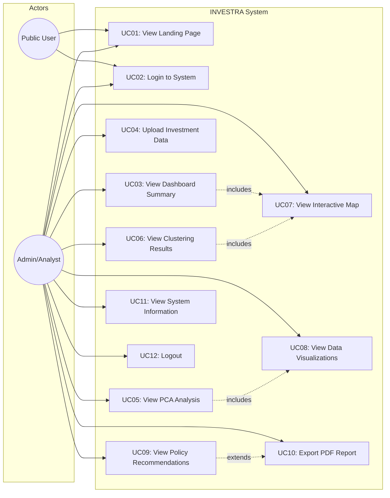

# Use Case Diagram - INVESTRA
## Investment Analytics Indonesia Dashboard

---

## 1. Use Case Diagram

---

## 2. Daftar Aktor

| Aktor | Deskripsi | Akses |
|-------|-----------|-------|
| **Public User** | Pengunjung yang belum login | Landing Page, Login |
| **Admin/Analyst** | Pengguna terotentikasi | Semua fitur sistem |

---

## 3. Daftar Use Case

| ID | Use Case | Aktor | Deskripsi | Pre-condition | Post-condition |
|----|----------|-------|-----------|---------------|----------------|
| UC01 | View Landing Page | Public, Admin | Melihat halaman utama | Akses website | Halaman landing ditampilkan |
| UC02 | Login to System | Public, Admin | Autentikasi pengguna | Berada di halaman login | Redirect ke dashboard |
| UC03 | View Dashboard Summary | Admin | Melihat ringkasan metrik | Login berhasil | Dashboard ditampilkan |
| UC04 | Upload Investment Data | Admin | Unggah dataset CSV/Excel | Login berhasil | Data tersimpan |
| UC05 | View PCA Analysis | Admin | Lihat hasil PCA | Data tersedia | Grafik PCA ditampilkan |
| UC06 | View Clustering Results | Admin | Lihat hasil K-Means | PCA selesai | Klaster ditampilkan |
| UC07 | View Interactive Map | Admin | Lihat peta Indonesia | Data klaster tersedia | Peta interaktif aktif |
| UC08 | View Data Visualizations | Admin | Lihat grafik & chart | Data tersedia | Visualisasi ditampilkan |
| UC09 | View Policy Recommendations | Admin | Lihat rekomendasi kebijakan | Klaster terbentuk | Rekomendasi ditampilkan |
| UC10 | Export PDF Report | Admin | Unduh laporan PDF | Analisis selesai | File PDF terunduh |
| UC11 | View System Information | Admin | Lihat info sistem | Login berhasil | Halaman about ditampilkan |
| UC12 | Logout | Admin | Keluar dari sistem | Sudah login | Redirect ke landing page |

---

## 4. Use Case Detail

### UC01: View Landing Page
- **Aktor**: Public User, Admin/Analyst
- **Trigger**: User mengakses URL website
- **Basic Flow**:
  1. User membuka browser
  2. User memasukkan URL sistem
  3. Sistem menampilkan landing page
  4. User melihat informasi sistem, berita, dan fitur
- **Alternative Flow**: Tidak ada
- **Exception Flow**: Tidak ada

### UC02: Login to System
- **Aktor**: Public User, Admin/Analyst
- **Trigger**: User klik tombol Login
- **Basic Flow**:
  1. User klik tombol Login
  2. Sistem menampilkan form login
  3. User memasukkan username dan password
  4. Sistem memvalidasi kredensial
  5. Sistem redirect ke dashboard
- **Alternative Flow**: 
  - 4a. Kredensial salah → Tampilkan error, kembali ke langkah 3
- **Exception Flow**: Tidak ada

### UC03: View Dashboard Summary
- **Aktor**: Admin/Analyst
- **Trigger**: User berhasil login
- **Basic Flow**:
  1. User login berhasil
  2. Sistem menampilkan dashboard layout
  3. Sistem menampilkan ringkasan metrik (34 provinsi, 3 klaster)
  4. Sistem menampilkan peta interaktif
  5. Sistem menampilkan grafik PCA
- **Alternative Flow**: Tidak ada
- **Exception Flow**: Tidak ada

### UC04: Upload Investment Data
- **Aktor**: Admin/Analyst
- **Trigger**: User klik menu Upload Data
- **Basic Flow**:
  1. User klik menu "Unggah Data"
  2. Sistem menampilkan halaman upload
  3. User memilih file CSV/Excel
  4. Sistem memvalidasi format file
  5. Sistem memproses dan menyimpan data
  6. Sistem menampilkan status sukses
- **Alternative Flow**:
  - 4a. Format tidak valid → Tampilkan error, kembali ke langkah 3
- **Exception Flow**: Tidak ada

### UC05: View PCA Analysis
- **Aktor**: Admin/Analyst
- **Trigger**: User klik menu Analisis PCA
- **Basic Flow**:
  1. User klik menu "Analisis PCA"
  2. Sistem load dataset
  3. Sistem menjalankan algoritma PCA
  4. Sistem menampilkan loading factor
  5. Sistem menampilkan explained variance chart
- **Alternative Flow**: Tidak ada
- **Exception Flow**: 
  - 2a. Dataset tidak tersedia → Tampilkan pesan untuk upload data

### UC06: View Clustering Results
- **Aktor**: Admin/Analyst
- **Trigger**: User klik menu K-Means Clustering
- **Basic Flow**:
  1. User klik menu "K-Means Clustering"
  2. Sistem load hasil PCA
  3. Sistem menampilkan 3 klaster
  4. Sistem menampilkan detail setiap klaster
  5. Sistem menampilkan daftar provinsi per klaster
- **Alternative Flow**: Tidak ada
- **Exception Flow**: Tidak ada

### UC09: View Policy Recommendations
- **Aktor**: Admin/Analyst
- **Trigger**: User klik menu Rekomendasi Kebijakan
- **Basic Flow**:
  1. User klik menu "Rekomendasi Kebijakan"
  2. Sistem load data klaster
  3. Sistem menampilkan rekomendasi per klaster
  4. User dapat expand accordion untuk detail
  5. User dapat klik "Unduh PDF" untuk export
- **Alternative Flow**: Tidak ada
- **Exception Flow**: Tidak ada
