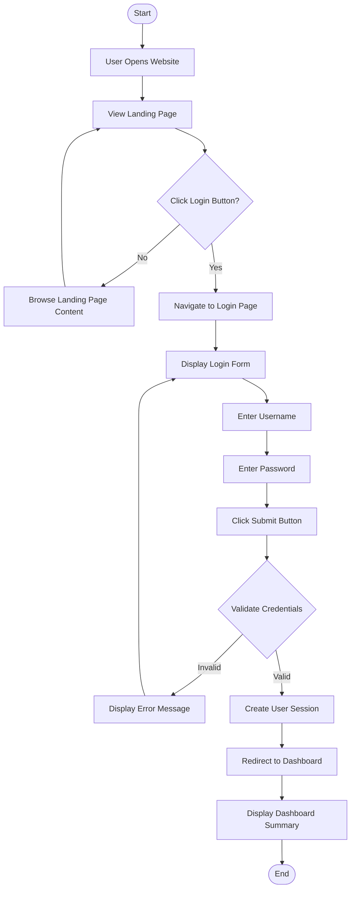
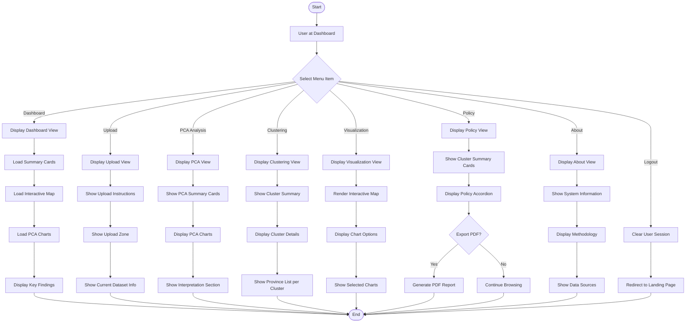
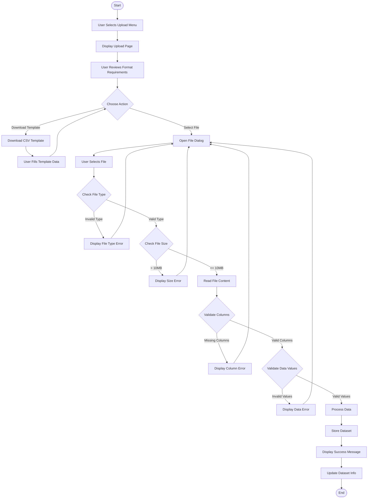
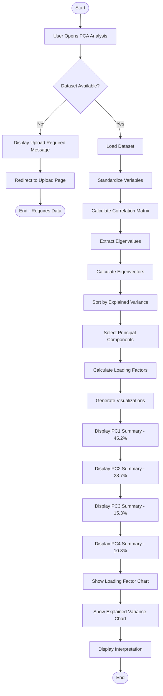
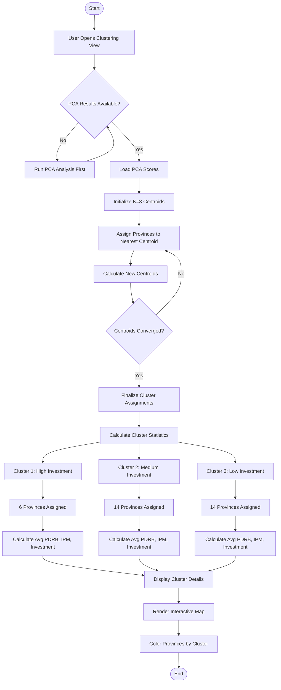
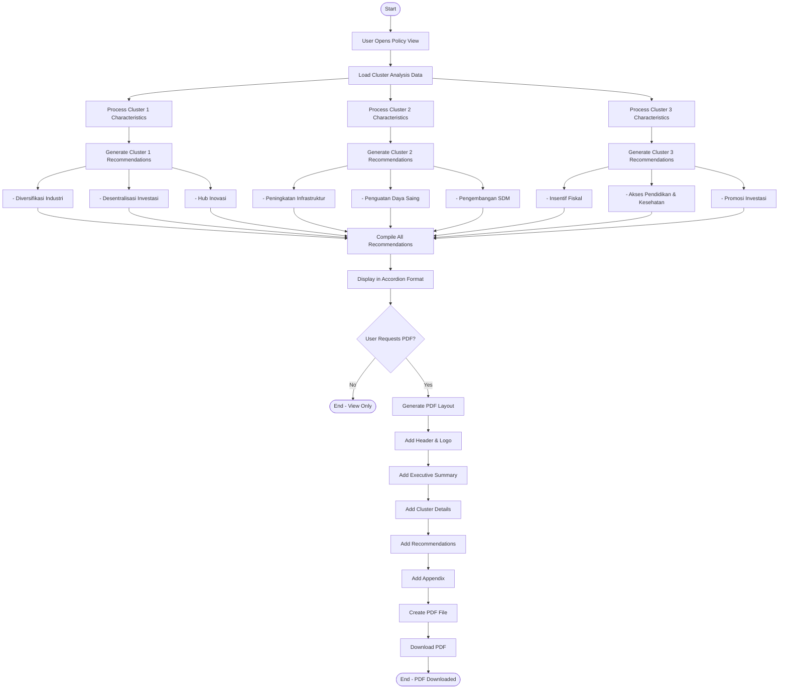
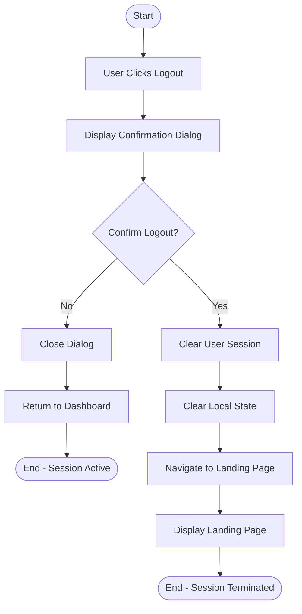

# Activity Diagram - INVESTRA
## Investment Analytics Indonesia Dashboard

---

## 1. Activity Diagram - User Authentication Flow

---

## 2. Activity Diagram - Dashboard Navigation Flow

---

## 3. Activity Diagram - Data Upload Process

---

## 4. Activity Diagram - PCA Analysis Workflow

---

## 5. Activity Diagram - K-Means Clustering Process

---

## 6. Activity Diagram - Policy Recommendation Generation

---

## 7. Activity Diagram - Logout Process

