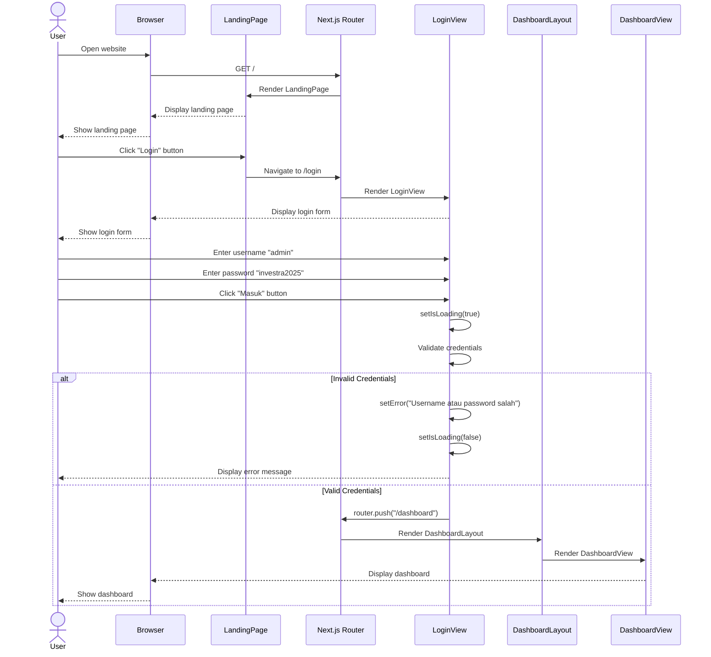
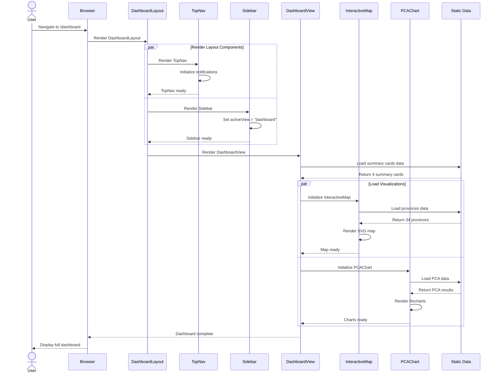
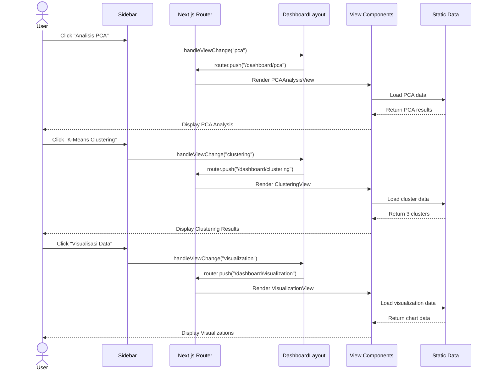
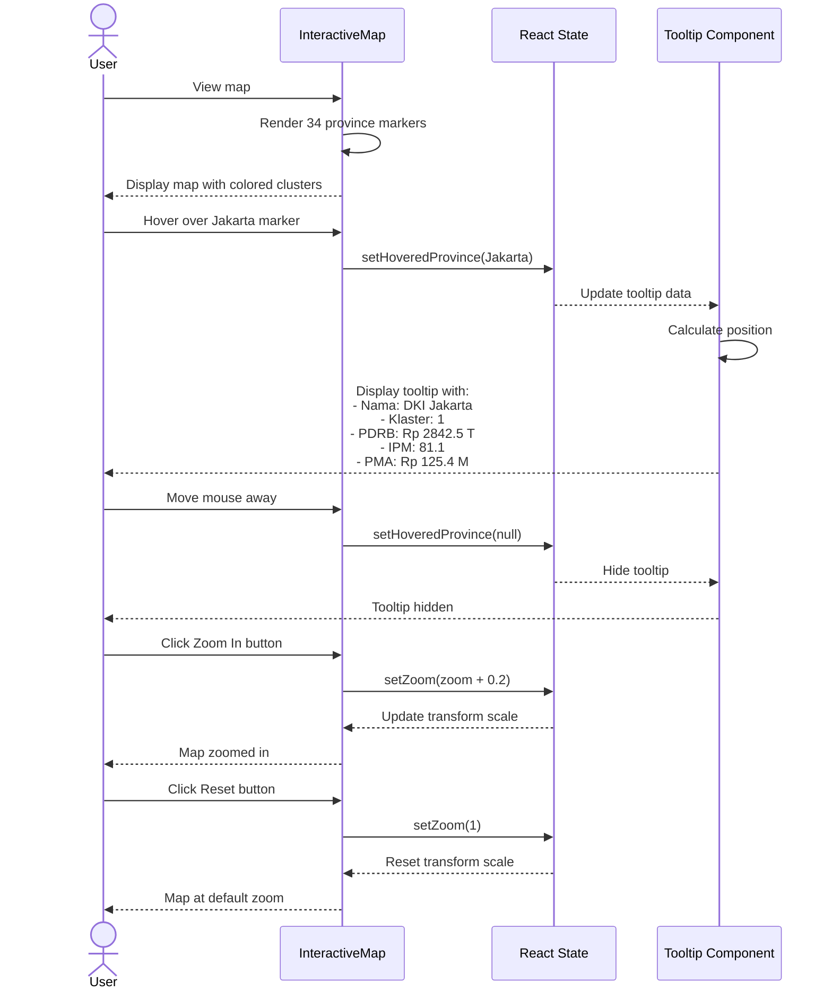
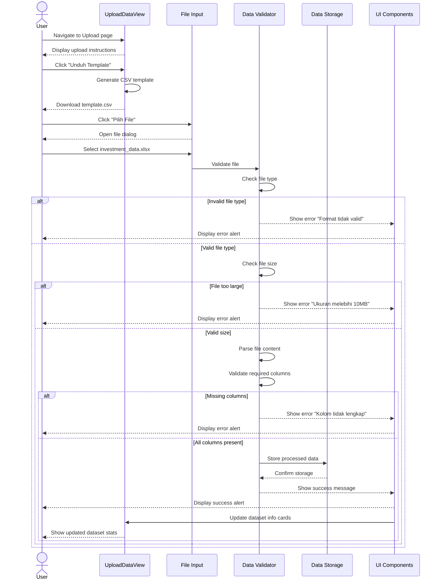
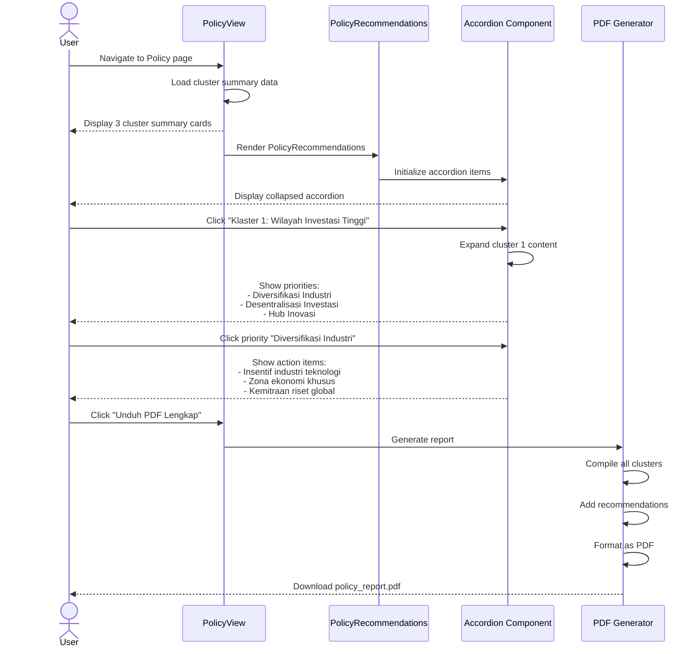
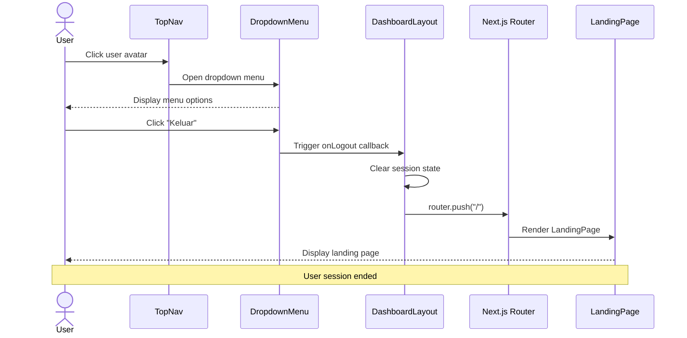
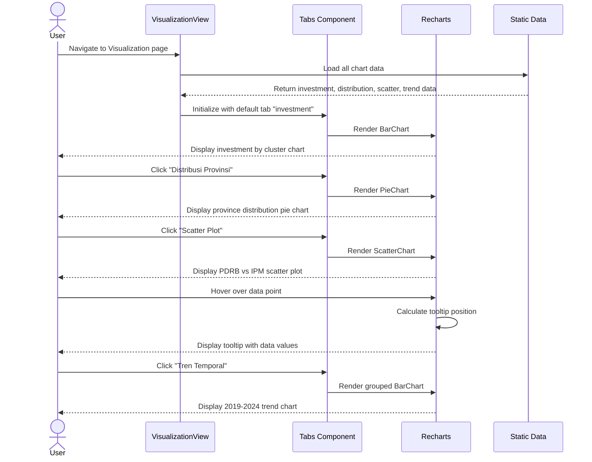

# Sequence Diagram - INVESTRA
## Investment Analytics Indonesia Dashboard

---

## 1. Sequence Diagram - User Login Process

---

## 2. Sequence Diagram - Dashboard Initialization

---

## 3. Sequence Diagram - Navigation Between Views

---

## 4. Sequence Diagram - Interactive Map Interaction

---

## 5. Sequence Diagram - Upload Data Flow

---

## 6. Sequence Diagram - Policy Recommendation View

---

## 7. Sequence Diagram - User Logout

---

## 8. Sequence Diagram - Chart Visualization

