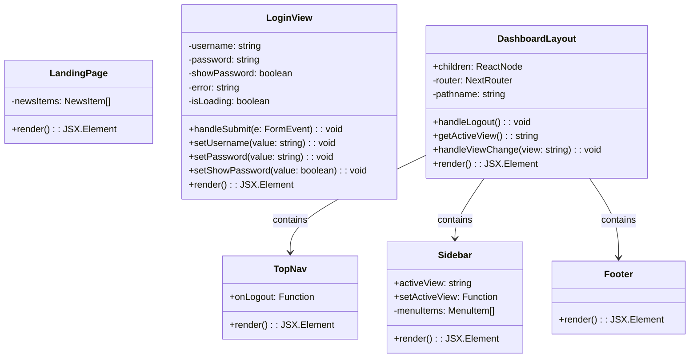
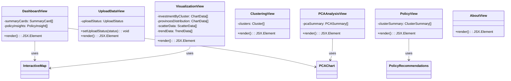
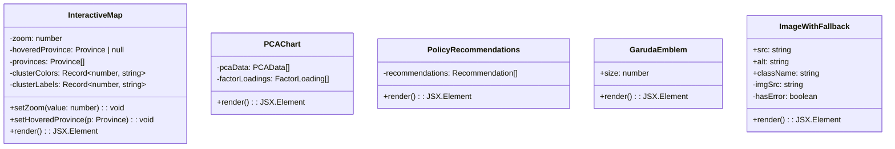
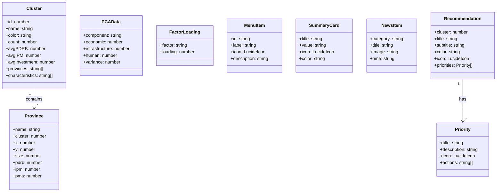
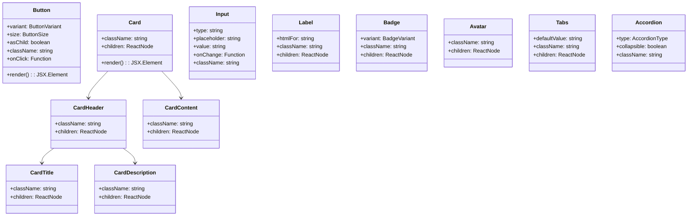
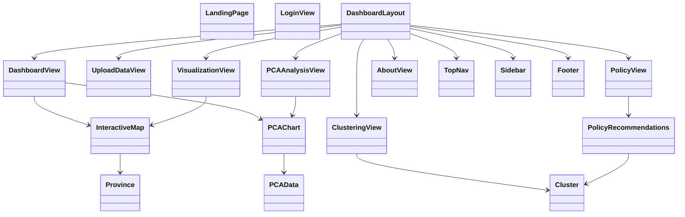
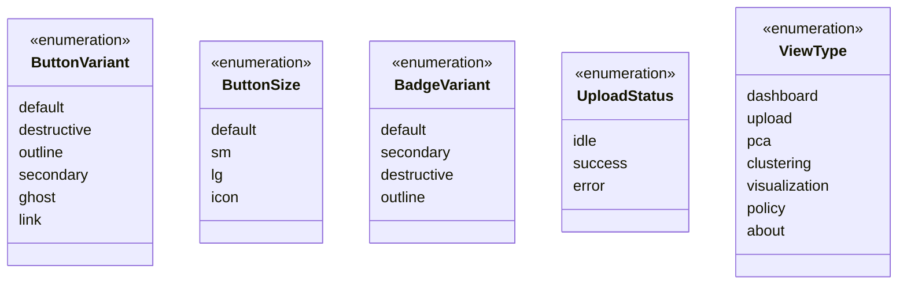

# Class Diagram - INVESTRA
## Investment Analytics Indonesia Dashboard

---

## 1. Class Diagram - Main Components

---

## 2. Class Diagram - View Components

---

## 3. Class Diagram - Chart Components

---

## 4. Class Diagram - Data Models

---

## 5. Class Diagram - UI Components

---

## 6. Complete Class Diagram - System Overview

---

## 7. Enum & Type Definitions

