# Arsitektur Sistem INVESTRA
## Investment Analytics Indonesia Dashboard

---

## 1. Arsitektur Sistem Overview


---

## 2. Use Case Diagram


### Deskripsi Use Case

| ID | Use Case | Aktor | Deskripsi |
|----|----------|-------|-----------|
| UC1 | View Landing Page | Public, Admin | Melihat halaman utama sistem |
| UC2 | Login to System | Public, Admin | Autentikasi untuk akses dashboard |
| UC3 | View Dashboard Summary | Admin | Melihat ringkasan metrik investasi |
| UC4 | Upload Investment Data | Admin | Mengunggah dataset investasi provinsi |
| UC5 | View PCA Analysis | Admin | Melihat hasil Principal Component Analysis |
| UC6 | View Clustering Results | Admin | Melihat hasil K-Means Clustering |
| UC7 | View Interactive Map | Admin | Melihat peta distribusi klaster |
| UC8 | View Data Visualizations | Admin | Melihat grafik dan chart data |
| UC9 | View Policy Recommendations | Admin | Melihat rekomendasi kebijakan |
| UC10 | Export PDF Report | Admin | Mengunduh laporan PDF |
| UC11 | View System Information | Admin | Melihat informasi tentang sistem |
| UC12 | Logout | Admin | Keluar dari sistem |

---

## 3. Activity Diagram

### 3.1 Activity Diagram - User Login Flow


### 3.2 Activity Diagram - Data Analysis Workflow


---

## 4. Sequence Diagram

### 4.1 Sequence Diagram - Login Process


### 4.2 Sequence Diagram - View Clustering Analysis


### 4.3 Sequence Diagram - Dashboard Navigation


---

## 5. Class Diagram


---

## 6. Component Hierarchy Diagram

```mermaid
flowchart TD
    subgraph App["Next.js App Router"]
        RootLayout[RootLayout<br/>app/layout.tsx]
        
        subgraph PublicPages["Public Pages"]
            HomePage[page.tsx → LandingPage]
            LoginPage[login/page.tsx → LoginView]
        end
        
        subgraph DashboardPages["Dashboard Pages"]
            DashLayout[dashboard/layout.tsx]
            DashPage[dashboard/page.tsx]
            UploadPage[dashboard/upload/page.tsx]
            PCAPage[dashboard/pca/page.tsx]
            ClusterPage[dashboard/clustering/page.tsx]
            VisPage[dashboard/visualization/page.tsx]
            PolicyPage[dashboard/policy/page.tsx]
            AboutPage[dashboard/about/page.tsx]
        end
    end
    
    RootLayout --> HomePage
    RootLayout --> LoginPage
    RootLayout --> DashLayout
    DashLayout --> DashPage
    DashLayout --> UploadPage
    DashLayout --> PCAPage
    DashLayout --> ClusterPage
    DashLayout --> VisPage
    DashLayout --> PolicyPage
    DashLayout --> AboutPage
```



---

## 7. Data Flow Diagram


---

## 8. Technology Stack

| Layer | Technology |
|-------|------------|
| **Frontend Framework** | Next.js 14 (App Router) |
| **UI Library** | React 18 |
| **Styling** | Tailwind CSS |
| **UI Components** | Radix UI + shadcn/ui |
| **Charts** | Recharts |
| **Icons** | Lucide React |
| **Language** | TypeScript |
| **Build Tool** | Next.js Built-in |

---

## 9. File Structure

```
investment_inequality_dashboard/
├── app/                          # Next.js App Router
│   ├── layout.tsx               # Root layout
│   ├── page.tsx                 # Landing page (/)
│   ├── globals.css              # Global styles
│   ├── login/
│   │   └── page.tsx             # Login page
│   └── dashboard/
│       ├── layout.tsx           # Dashboard layout
│       ├── page.tsx             # Dashboard main
│       ├── upload/page.tsx
│       ├── pca/page.tsx
│       ├── clustering/page.tsx
│       ├── visualization/page.tsx
│       ├── policy/page.tsx
│       └── about/page.tsx
├── components/                   # Reusable components
│   ├── ui/                      # UI primitives
│   │   ├── button.tsx
│   │   ├── card.tsx
│   │   ├── tabs.tsx
│   │   └── ...
│   ├── LandingPage.tsx
│   ├── LoginView.tsx
│   ├── TopNav.tsx
│   ├── Sidebar.tsx
│   ├── DashboardView.tsx
│   ├── InteractiveMap.tsx
│   ├── PCAChart.tsx
│   └── ...
├── lib/
│   └── utils.ts                 # Utility functions
├── next.config.js
├── tailwind.config.ts
├── tsconfig.json
└── package.json
```

---

## 10. Kesimpulan

Sistem INVESTRA dibangun dengan arsitektur **Client-Side Rendering** menggunakan Next.js 14 App Router dengan pendekatan **Component-Based Architecture**. Sistem ini memisahkan:

1. **Presentation Layer**: Halaman dan routing berbasis file system
2. **Component Layer**: Komponen UI yang reusable
3. **Data Layer**: Static data untuk simulasi (dapat diganti dengan API)

Diagram UML yang dibuat mencakup:
- **Use Case Diagram**: 12 use cases untuk 2 aktor
- **Activity Diagram**: Workflow login dan analisis data
- **Sequence Diagram**: Interaksi antar komponen
- **Class Diagram**: Struktur komponen dan data models
